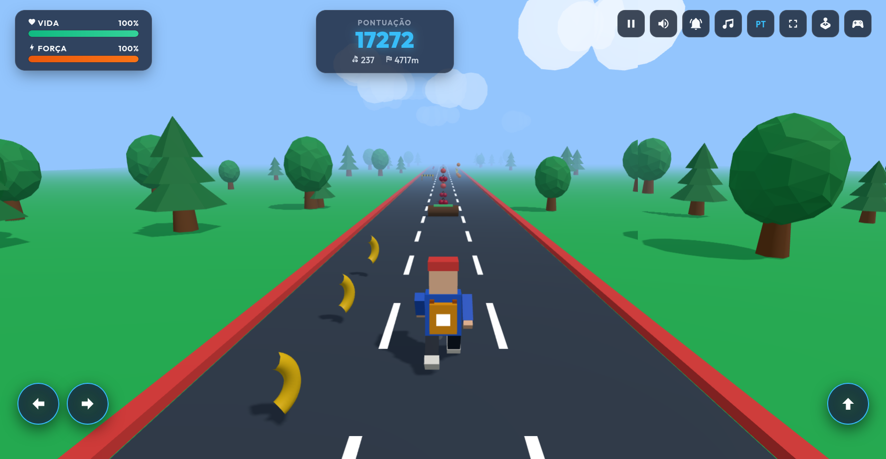

# Endless Runner 3D - Three.js & Joystick

🇧🇷 Versão em Português | [🇺🇸 English Version](README.md)

🎮 **Teste Online (Live Demo)**: [https://endless-runner-game-delta.vercel.app/](https://endless-runner-game-delta.vercel.app/)




Um jogo 3D **Endless Runner** vibrante, fluido e completo desenvolvido em **JavaScript puro (Vanilla JS)** com **Three.js**, **Vite** e **Iconify** (100% modular e agnóstico, sem dependência de React ou outros frameworks pesados).

O projeto conta com jogabilidade infinita em 3 faixas, suporte completo a **Teclado**, **Joysticks / Gamepads físicos via USB/Bluetooth** (com layouts dedicados para Xbox e PlayStation e vibração háptica), **Controle Analógico Virtual (Thumbstick)** e **Botões de Toque (D-Pad)** para dispositivos móveis, efeitos sonoros e trilha sonora procedurais sintetizados em tempo real via **Web Audio API**, sistema de **Multilocalização (pt-BR e en-US)** com detecção automática, alternância de **Tela Cheia (Fullscreen)** e persistência de todas as configurações no **`localStorage`**.

---

## 🎮 Mecânicas e Funcionalidades do Jogo

### 1. Cenário e Gráficos 3D (Three.js)
- **Pista Infinita com 3 Faixas**:
  - Estrada com faixas divisórias tracejadas e marcadores laterais que se movem gerando forte sensação de velocidade.
  - Terreno circundante com gramados, pinheiros, árvores frondosas estilizadas e nuvens procedurais no céu.
  - Efeito de neblina suave no horizonte (*fog*) e iluminação dinâmica com sombras suaves (`PCFSoftShadowMap`).
  - Câmera suave em terceira pessoa com amortecimento que acompanha as manobras laterais e saltos do personagem.
- **Personagem 3D Estilizado e Animado**:
  - Modelado proceduralmente em Three.js (carregamento instantâneo sem arquivos 3D externos pesados).
  - Rosto amigável e detalhado voltado para a direção da corrida, com olhos expressivos, pupilas, sorriso e boné com aba.
  - Mochila nas costas visível pela câmera em terceira pessoa.
  - Animação contínua de corrida sincronizada com a velocidade, inclinação lateral nas curvas, salto acrobático e partículas de poeira levantadas no solo.

### 2. Obstáculos e Dinâmica de Colisão
- **Obstáculos Variados**:
  - Troncos de árvores caídos com musgo, barreiras de trânsito listradas com refletores e pedras no asfalto.
  - Frequência justa e progressão de velocidade suave com a distância percorrida.
- **Colisão Sem Fim (*Endless*)**:
  - Ao bater em um obstáculo, o jogador perde pontos (-120 pts), perde vida (-25%) e força (-20%), estremece, pisca em invulnerabilidade temporária e **retorna suavemente para o meio (faixa central)** continuando a correr.
  - O jogo não possui tela frustrante de game over: mesmo que a barra de vida esgote, o personagem recupera o fôlego e continua correndo infinitamente.

### 3. Frutas Colecionáveis 3D
- **Variedade de Frutas**:
  - **Maçãs vermelhas** (+60 pts, +12% vida, +15% força)
  - **Bananas douradas** (+80 pts, +15% vida, +18% força)
  - **Cerejas duplas** (+100 pts, +18% vida, +20% força)
  - **Laranjas cítricas** (+120 pts, +20% vida, +25% força)
- Flutuam e giram suavemente pelo caminho, dispostas em fileiras ou em arcos de salto.
- Coletá-las gera um som harmônico (*chime* sintetizado), partículas coloridas específicas para cada fruta e notificações na tela.

### 4. Áudio Procedural em Tempo Real (Web Audio API)
- Efeitos sonoros gerados por síntese via código, sem necessidade de carregar arquivos de áudio externos (.mp3/.wav):
  - Som de salto parabólico (onda triangular com modulação de frequência).
  - Som de impacto com obstáculo (onda dente de serra com ruído filtrado).
  - Chimes musicais harmônicos para coleta de frutas.
  - Trilha sonora chiptune/synthwave retrô contínua e dinâmica.
- **Controles Rápidos de Áudio no HUD**:
  - Mudo Geral (`iconify-icon icon="mdi:volume-high"` / `mdi:volume-off`).
  - Ativar / Desativar Efeitos Sonoros (SFX) (`mdi:bell-ring` / `mdi:bell-off`).
  - Ativar / Desativar Música de Fundo (BGM) (`mdi:music` / `mdi:music-off`).

### 5. Multilocalização Dinâmica (i18n)
- Suporte completo aos idiomas **Português (`pt-BR`)** e **Inglês (`en-US`)**.
- Detecção automática do idioma do navegador na inicialização.
- Botão de alternância instantânea no HUD (`PT` / `EN`).
- Atualização em tempo real de interface, modais, tooltips, notificações, nomes de botões do joystick e nomes das frutas.
- Persistência da preferência de idioma no `localStorage`.

### 6. Tela Cheia (Fullscreen)
- Botão dedicado no HUD para entrar e sair de tela cheia.
- Atalho rápido pelo teclado através da tecla **`F`**.
- Atualização dinâmica do ícone e tooltip de acordo com o estado (`fullscreenchange`).

---

## 🕹️ Controles: Teclado, Joysticks Físicos e Touch

O jogo possui um sistema de entrada unificado que suporta múltiplos métodos de controle simultaneamente:

### 1. Teclado e Gamepad / Joystick Físico (USB e Bluetooth)
- **Presets de Nomenclatura**:
  - **Xbox (XInput)**: `A`, `B`, `X`, `Y`, `LB`, `RB`, `LT`, `RT`, `View`, `Menu`, `D-Pad`, etc.
  - **PlayStation (DualShock / DualSense)**: `✕ (Cruz)`, `○ (Círculo)`, `□ (Quadrado)`, `△ (Triângulo)`, `L1`, `R1`, `L2`, `R2`, `Share`, `Options`, `D-Pad`, `L3`, etc.
- **2 Entradas por Ação (Teclado + Joystick)**:
  - Cada ação possui dois slots independentes configuráveis:
    - Slot 1: Teclado
    - Slot 2: Joystick (botões digitais, direcionais D-Pad ou eixos analógicos com deadzone configurável)
- **Remapeamento Interativo**:
  - Clique em qualquer slot no modal de configurações e pressione a nova tecla ou botão do controle.
- **Vibração Háptica no Controle**:
  - Suporte à API Gamepad Haptics (`dual-rumble`).
  - O controle vibra durante os impactos com obstáculos e emite pulsos suaves ao coletar frutas.
  - Botão **"Testar Vibração"** disponível no modal de configurações.

| Ação | Teclado Padrão | Alternativas | Joystick (Xbox) | Joystick (PlayStation) |
|---|---|---|---|---|
| **Mover para Esquerda** | `Seta Esquerda` | `A` | `D-Pad Esquerda` ou `Analógico Esq (←)` | `D-Pad Esquerda` ou `Analógico Esq (←)` |
| **Mover para Direita** | `Seta Direita` | `D` | `D-Pad Direita` ou `Analógico Esq (→)` | `D-Pad Direita` ou `Analógico Esq (→)` |
| **Pular / Planar** | `Barra de Espaço` (segure no ar para planar) | `Seta Cima` / `W` | `Botão A` | `Botão ✕ (Cruz)` |
| **Pausar / Continuar** | `Esc` | `P` | `Menu / Start` | `Options / Start` |
| **Tela Cheia** | `F` | — | — | — |

- **Asas de Planador (*Hang Glider / Paraglider*)**:
  - Um toque rápido faz o personagem saltar normalmente.
  - **Manter pressionado** o botão de pulo (no teclado, controle físico, botão de toque `#touch-jump` ou puxando o analógico virtual para cima) faz abrir **asas de planador 3D**, sustentando o personagem no ar e permitindo planar suavemente com queda lenta.
  - **Requisito e Consumo de Força (Strength)**:
    - É necessário ter pelo menos **15% de Força** para abrir o planador.
    - Planar consome força de forma contínua a 18 unidades/segundo.
    - Se a força atingir 0% durante o voo, o planador se fecha automaticamente e emite um alerta.
    - Ao correr no solo, a força regenera suavemente até 35%, permitindo que o jogador sempre volte a planar.
  - Assim que toca o solo (ou caso o botão seja solto), o planador se recolhe instantaneamente e a corrida continua sem interrupções.

### 2. Controles de Toque na Tela (Mobile / Tablets)
- **Dois Modos Disponíveis**:
  1. **Setas Direcionais (D-Pad)**: Botões estilizados com setas direcionais para esquerda e direita, além do botão de salto.
  2. **Controle Analógico Virtual (`VirtualJoystick`)**: Thumbstick circular com retorno em mola, cálculo vetorial polar, zona morta e detecção de salto ao puxar o analógico para cima.
- **Alternância Rápida**:
  - Botão dedicado no HUD para alternar entre Setas e Analógico com um clique.
  - Seletor de modo nas Configurações de Controles.
- **Manter Direção Pressionada (Auto-Repeat)**:
  - Ao manter o analógico inclinado ou os botões de seta/teclas pressionados, o movimento é invocado continuamente (delay inicial de 220ms e repetição a cada 180ms), permitindo atravessar faixas suavemente.
- **Ergonomia e Responsividade**:
  - Controles posicionados acima das áreas de toque do sistema e safe areas (`calc(3.5rem + env(safe-area-inset-bottom))`).
  - Em celulares e tablets, os botões de ação do topo são centralizados para facilitar o alcance com as duas mãos.

---

## 💾 Persistência de Dados (`localStorage`)

Todas as preferências do usuário são salvas automaticamente:
- `endless_runner_locale`: Idioma selecionado (`pt-BR` ou `en-US`).
- `endless_runner_audio`: Configurações de som (mudo geral, SFX ligado/desligado, BGM ligado/desligado).
- `endless_runner_gamepad_preset`: Preset do controle (`xinput` ou `dualshock`).
- `endless_runner_controls`: Mapeamento customizado de teclas e botões de joystick.
- `endless_runner_touch_mode`: Modo de toque preferido (`dpad` ou `analog`).

---

## 🛠️ Tecnologias e Bibliotecas

- **[Three.js](https://threejs.org/)**: Renderização 3D via WebGL, câmera perspectiva, luz solar direcional, sombras suaves, névoa e animação esquelética/procedural.
- **[Vite](https://vitejs.dev/)**: Ferramenta de build de última geração com recarregamento ultrarrápido (HMR).
- **[Iconify](https://iconify.design/)**: Ícones vetoriais modernos (`<iconify-icon>`) sem pacotes de fontes pesados.
- **Web Audio API**: Motor sonoro sintetizado em tempo real.
- **Gamepad API**: Detecção de joysticks, deadzone analógico e vibração háptica de duplo motor.
- **HTML5 Fullscreen API**: Alternância responsiva de tela cheia.

---

## 🚀 Como Executar Localmente

> **Experimente no navegador**: Você pode testar e jogar diretamente sem precisar instalar nada através de [endless-runner-game-delta.vercel.app](https://endless-runner-game-delta.vercel.app/).

### Pré-requisitos
- **Node.js** (versão 18 ou superior)
- **npm** ou **yarn** / **pnpm**

### Instalação

1. Clone o repositório:
```bash
git clone https://github.com/tiagofrancafernandes/Game-Endless-Runner-3D.git
cd Game-Endless-Runner-3D
```

2. Instale as dependências:
```bash
npm install
```

3. Inicie o servidor de desenvolvimento:
```bash
npm run dev
```

4. Abra a URL exibida no terminal (por padrão `http://localhost:5173/`).

### Compilação para Produção

Para gerar os arquivos estáticos otimizados para distribuição na pasta `dist/`:
```bash
npm run build
```

Para pré-visualizar o build de produção localmente:
```bash
npm run preview
```

---

## 📁 Estrutura de Diretórios

```
jogo-threejs-joystick/
├── index.html                  # Interface HTML principal, HUD e modais
├── README.md                   # Documentação em inglês (padrão)
├── README.pt-br.md             # Documentação em português
├── AGENTS.md                   # Diretrizes técnicas para agentes de IA e desenvolvedores
├── package.json                # Configuração do projeto e dependências
├── vite.config.js              # Configuração do Vite
├── screenshot.png              # Captura de tela do jogo (HUD em inglês)
├── screenshot.pt-br.png        # Captura de tela do jogo (HUD em português)
├── src/
│   ├── main.js                 # Ponto de entrada, inicialização do jogo e UI
│   ├── style.css               # Estilos com glassmorphism, HUD e controles
│   ├── audio/
│   │   └── AudioManager.js     # Sintetizador procedural via Web Audio API
│   ├── entities/
│   ├── game/
│   │   ├── Game.js             # Loop principal, estados, pontuação e colisões
│   │   ├── Player.js           # Malha 3D do personagem, física e animações
│   │   ├── SceneManager.js     # Cenário 3D, pista, iluminação, sombras e câmera
│   │   ├── ObstacleManager.js  # Criação procedural e pooling de obstáculos
│   │   ├── FruitManager.js     # Criação de frutas 3D colecionáveis e rotação
│   │   └── ParticleSystem.js   # Sistema de partículas para poeira e coleta
│   ├── i18n/
│   │   ├── I18nManager.js      # Gerenciador de idiomas e subscrição reativa
│   │   └── translations.js     # Dicionários em pt-BR e en-US
│   ├── input/
│   │   ├── GamepadAdapter.js   # Gamepad API, vibração e presets Xbox/PlayStation
│   │   ├── InputManager.js     # Gerenciador unificado de entradas e auto-repeat
│   │   └── KeyConfig.js        # Mapeamentos de teclas e persistência
│   └── ui/
│       ├── UIManager.js        # Gerenciamento de HUD, modais, eventos e i18n
│       └── VirtualJoystick.js  # Analógico virtual na tela com física de mola
```

---

## 📄 Licença

Este projeto está sob licença MIT. Sinta-se livre para clonar, estudar e aprimorar.
